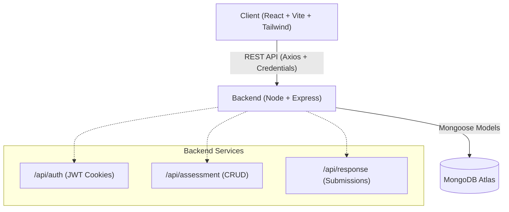

# AssessFlow

AssessFlow is a modern, full-stack platform designed to streamline the creation, distribution, and analysis of complex hierarchical assessments. It empowers users to build nested assessments (Categories → Factors → Questions) using an intuitive drag-and-drop interface, gather respondent data, and visualize submissions securely.

## 🚀 Tech Stack
- **Frontend:** React, Vite, Tailwind CSS (with custom design tokens), `@dnd-kit` for drag-and-drop.
- **Backend:** Node.js, Express.js.
- **Database:** MongoDB Atlas, Mongoose.
- **Authentication:** JSON Web Tokens (JWT) secured via `HttpOnly`, `Secure`, and `SameSite=None` cookies.

---

## 🛠 Setup Instructions

### 1. Clone the repository
```bash
git clone https://github.com/yourusername/assessflow.git
cd assessflow
```

### 2. Environment Variables
Create a `.env` file in the `backend` directory:
```env
NODE_ENV=development
PORT=5001
MONGO_URI=mongodb+srv://<user>:<password>@cluster.mongodb.net/assessflow?retryWrites=true&w=majority
JWT_SECRET=generate_a_strong_random_hex_string_here
CLIENT_URL=http://localhost:5173
```
*(Note: A `.env.example` is provided in the backend directory. The backend will refuse to start if `JWT_SECRET` is missing, ensuring secure deployments.)*

Create a `.env` file in the `client` directory (if needed for API routing):
```env
VITE_API_URL=http://localhost:5001/api
```

### 3. Install Dependencies
```bash
# Backend
cd backend
npm install

# Frontend
cd ../client
npm install
```

### 4. Run Development Servers
Open two terminal windows:
```bash
# Terminal 1: Start Backend
cd backend
npm run dev

# Terminal 2: Start Frontend
cd client
npm run dev
```

---

## 🏗 Architecture Overview

AssessFlow uses a standard decoupled client-server architecture. 



* **Authentication Flow:** JWTs are issued by the backend upon login and stored exclusively in `HttpOnly` cookies. The frontend relies on Axios interceptors (`withCredentials: true`) to automatically append the cookie to protected API calls, fully mitigating XSS vulnerabilities.
* **Frontend Routing:** React Router is used for client-side routing, protected by an AuthContext that verifies session validity.
* **Launch Pad & Builder:** The Builder allows creators to author tests, while the Launch Pad dynamically fetches published tests specifically scoped to the logged-in candidate to verify submission status.

---

## 🧠 Key Decisions Made

1. **Security-First Authentication:**
   - **No Hardcoded Secrets:** The application strictly enforces the presence of a strong `JWT_SECRET` in the environment variables, failing to boot if it relies on a hardcoded fallback.
   - **Cookie-based Sessions:** By storing the JWT in an `HttpOnly` cookie rather than `localStorage`, the application is protected against cross-site scripting (XSS) token theft. 

2. **Tailwind Custom Design System:**
   - Instead of relying on a heavy component library like Material UI, the frontend utilizes Tailwind CSS injected with a highly customized theme configuration (`theme.extend.colors` and `theme.extend.spacing`). This ensures consistent typography, radii, and component shapes across the app with minimal footprint.

3. **Per-User Data Scoping:**
   - The Launch Pad endpoint (`/api/assessment/launch-pad`) is heavily optimized to compute the candidate's exact submission status on the backend. It determines `hasSubmitted` by intersecting the published assessments with the `req.user._id`'s submissions, completely avoiding over-fetching global data to the client.

4. **Denormalized Database Queries:**
   - To prevent expensive N+1 queries when building reports, the `ownerId` (the creator of the assessment) is denormalized directly onto the `Response` schema. This allows creators to instantly fetch all responses for all their assessments in a single indexed query.

5. **Responsive and Accessible Form Elements:**
   - Native `<select>` elements and custom dropdowns have been heavily styled to use absolute custom chevrons (`pr-8 appearance-none`). This prevents native UI overlap bugs when label text runs long on mobile devices.
   - Fixed mobile elements (like the hamburger menu) are built using padding reservations rather than absolute overlays to prevent text collisions.
